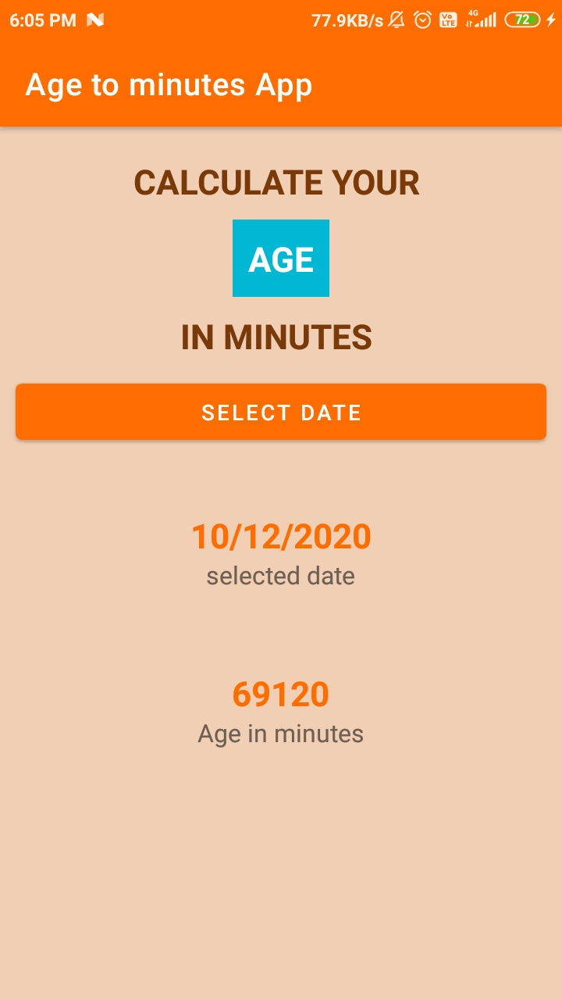

# Age To Minute Android App

<h5>
So in this project i am not going to focus on like how to convert your age into minute, but instead of that we will focus 
on how to write clean code with the help of MVVM. 
</h5>

In this project we will use MVVM , dagger hilt , kotlin flows and Coroutines to build a simple Age to Minute converter App . Hope you will enjoy and learn something new from this app

<ol>
  <li> MVVM </li>
  <li> Dagger Hilt </li>
  <li> Kotlin-Flow </li>
  <li> Kotlin-Coroutines </li>
  <li> StateFlow </li>
</ol>

<h4>
Screenshots
</h4>

